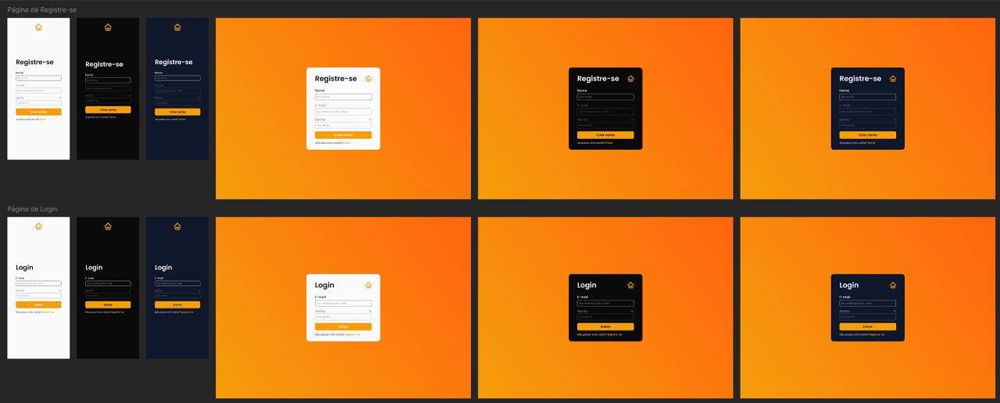
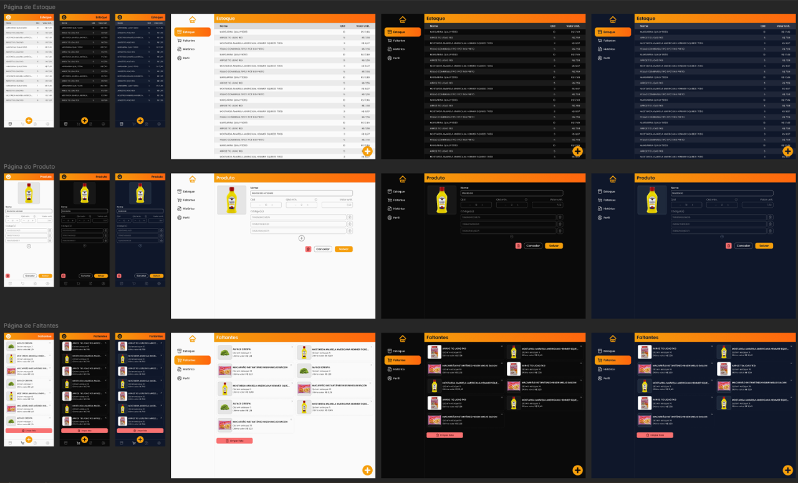
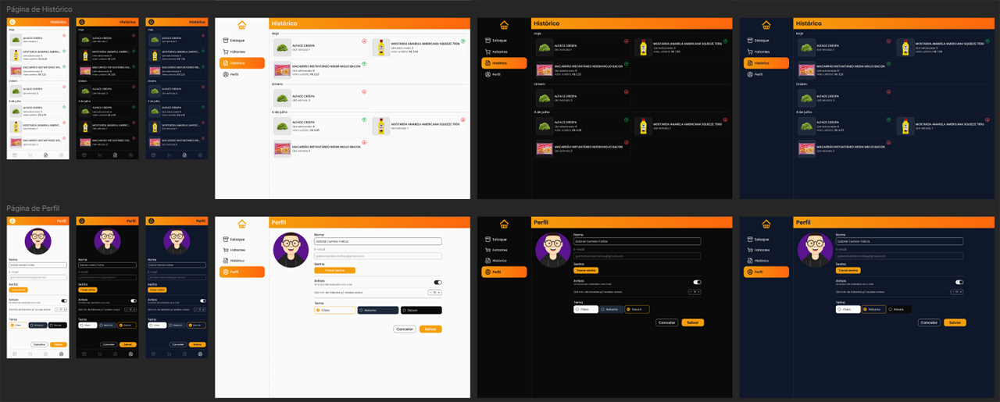

<h1 align="center">Sistema GIS</h1>

  <h3 align="left">Front-end</h3>
  

    
    
    
    
    
  

  
  <h3 align="left">Back-end</h3>
  

    
    
    
    
    
    
  

 

  
  

<h4 align="center">
  
  [Ver projeto](https://sistemagis.com.br/)
</h4>

 

  <a href="#projeto">Sobre o projeto</a> •
  <a href="#surgimento">Surgimento do projeto</a> •
  <a href="#design">Design do projeto</a>  •
  <a href="#tecnologias">Tecnologias</a>

 

## 💻 Sobre o projeto

**O Sistema GIS (Gestão Inteligente de Suprimentos) é um projeto freelance full-stack** desenvolvido com o objetivo de facilitar o gerenciamento do estoque doméstico. Para isso, ele fornece diversas funcionalidades como:
 - Adição de produto ao estoque através do scan de seu código de barras, facilitando o processo
 - Diminuir quantidade do produto em estoque também através do scan de seu código
 - Visualização do estoque
 - Visualização de itens faltantes em estoque
 - Visualização de histórico, permitindo uma comparação entre preços passados e atuais
 - Envio de relatórios para o e-mail do usuário ao atingir determinada quantidade de itens faltantes

Você pode acessar o projeto clicando [aqui](https://sistemagis.com.br/).

> **Nota**:
> O codigo do projeto não está público por se tratar de um freelance

## 🌱 Surgimento do projeto
Inicialmente, me foi apresentado um slide sobre o problema em questão, com os tópicos:
- Esquecer itens na lista de compras é comum, resultando em viagens desnecessárias ao supermercado
- Rupturas de estoque geram frustração, gastos extras em compras menores e impedem a oganização das refeições
- Listas manuais são propensas a erros e podem ser facilmente perdidas

Além disso, também foi apresentado um slide acerca da ideia do projeto, com os tópicos a seguir:
- Utilize seu smartphone para escanear códigos de barras dos produtos consumidos, atualizando automaticamente as quantidades em estoque
- Receba relatórios personalizados a cada X itens faltantes, facilitando a reposição do estoque
- Adicione, consulte e exclua produtos com facilidade, mantendo a lista sempre atualizada
- Passo a passo para utilização:
  - Crie sua conta: cadastre-se no nosso sistema gratuito e configure seu perfil
  - Adicione produtos: insira a lista completa de produtos que você consome em casa, incluindo nome, preço e quantidade inicial
  - Gerencie o estoque: utilize seu smartphone para escanear códigos de barras dos produtos consumidos, atualizando automaticamente as quantidades em estoque
  - Receba relatórios: a cada X itens faltantes, você receberá um relatório personalizado com a lista de produtos para reposição
  - Faça suas compras: utilize o relatório para realizar suas compras de forma organizada e eficiente, evitando rupturas de estoque
 
A partir disso, objetivando solucionar um problema, o projeto começou a ser desenvolvido.

## 🖌 Design do projeto
Para começar, foi construído o design no site no Figma. Durante sua construção, o principal foco foi a adaptação do layout para as diversas telas e dispositivos, além disso, houve destaque também para os temas da aplicação, ou seja, os modos claro, escuro, e noturno.

  
  
  
  
  
  

## 🚀 Tecnologias
### Front-end
- ReactJS
- NextJS
- Typescript
- TailwindCSS
- Shadcn/ui
### Back-end
- NodeJS
- Fastify
- Typescript
- Zod
- Prisma
- MySQL

## 👨🏻‍💻 Autor: Gabriel Centeio Freitas 

  
  

